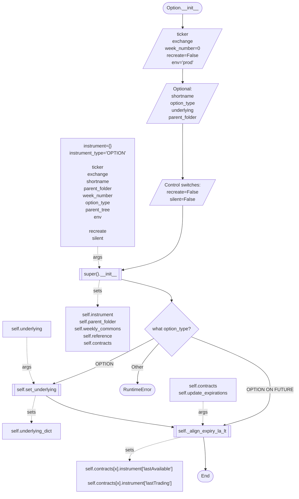
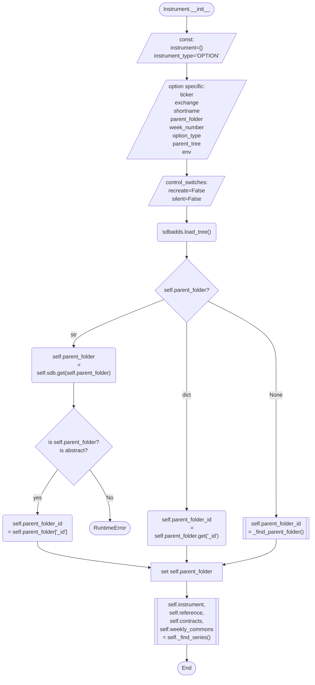
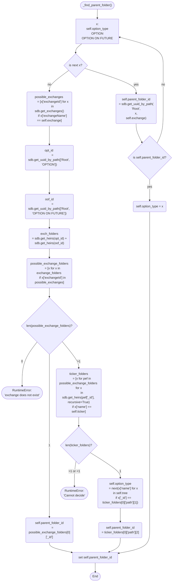
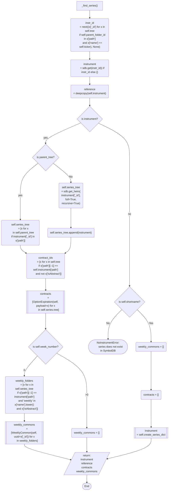
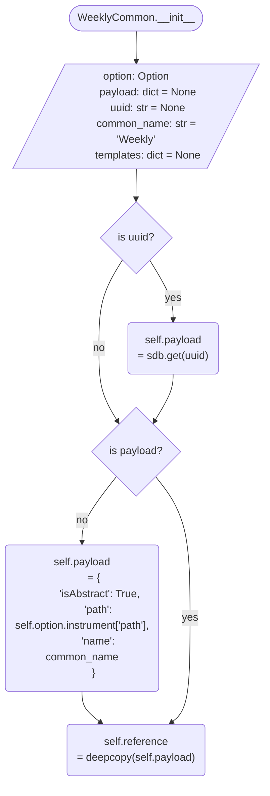

## Option init

## Option: super.\_\_init\_\_

## _find_parent_folder
Parent folder is not the direct parent for option series, it's just root -> OPTION (or OPTION ON FUTURE) -> exchange folder  
direct parent could be situated deeper (e.g. Root -> OPTION ON FUTURE -> CME -> Agriculture -> HE)

## \_find_series

## OptionExpiration.\_\_init\_\_

```mermaid
flowchart TB
    OptionExpiration(["OptionExpiration.__init__"])
    --> opt_init_req[/"
        option: Option
        expiration_date [str, date, datetime] = None
        strikes: dict = None
        maturity: str = None
        payload: dict = None
        expiration_underlying: str = None 
    "/]

    --> super_init[["super().__init__"]]
    super_init_args["
        instrument={}
        instrument_type='OPTION'
        env
    "] -.-> |args| super_init
    --> self_instr("
        self.instrument
        = payload
    ")
    --> is_exp_date{"is expiration_date?"}
    --> |yes| exp_date_format{"
        expiration date
        format?
    "}
    is_exp_date --> |no| is_instr_exp
    exp_date_format --> |str| date_str("
        try:
        self.expiration
        = dt.date.fromisoformat(
            expiration_date)
    ")
    --> |ValueError| is_instr_exp{"is self.instrument?"}
    --> |no| exp_err(["
        ExpirationError:
        Invalid expiration date format
    "])
    is_instr_exp --> |yes| exp_from_instr("
        self.expiration
        = sdb.sdb_to_date(
        self.instrument['expiry'])
    ")
    --> set_exp
    exp_date_format --> |date| date_date("
        self.expiration
        = expiration_date
    ")
    --> set_exp
    exp_date_format --> |datetime| date_dt("
        self.expiration
        = expiration_date.date()
    ")
    --> set_exp["set self.expiuration"]
    set_exp --> if_mat{"is maturity?"}
    --> |yes| format_mat_str[["
        self.maturity
        = self.format_maturity(
            maturity)
    "]]
    --> set_maturity["set self.maturity"]
    if_mat --> |no| is_instr_mat{"
        is maturityDate
        in self.instrument?
    "}
    --> |yes| format_instr_mat[["
        self.maturity
        = self.format_maturity(
            self.instrument['maturityDate'])
    "]]
    --> set_maturity
    is_instr_mat --> |no| set_mat_from_exp("
        self.maturity
        = self.expiration.strftime('%Y-%m')
    ")
    --> set_maturity{"is self.maturity?"}

    comp_prnt_args["
        [self.option.compiled_parent,
        self.option.instrument]
        include_self=True
    "] -.-> |args| comp_prnt[["
        self.compiled_parent
        = sdbadds.build_inheritance
            
    "]]
    set_maturity --> |no| exp_err_mat(["
        ExpirationError:
        Cannot format maturity
    "])
    set_maturity --> |yes| comp_prnt
    comp_prnt --> is_instr{"is self.instrument?"}
    is_instr --> |yes| is_path
    is_instr --> |no| is_strikes{"is strikes?"}
    is_strikes --> |yes| mk_dict[["
        build_expiration_dict(strikes)
    "]]
    is_strikes --> |no| exp_err_str(["
        ExpirationError:
        Strikes dict is required
    "])
    mk_dict --> is_path{"
        is path
        in self.instrument?
    "}
    mk_dict -.-> |sets| set_self_instr["self.instrument"]
    is_path --> |no| set_path("
        self.instrument['path']
        = deepcopy(option.instrument['path'])
    ")
    --> is_id_in_opt{"
        is _id in
        option.instrument?
    "}
    --> |no| set_fake_id("
        self.instrument['path'].append('new series id')
    ")
    --> set_def_str("self.instrument.setdefault('strikePrices', {})")
    --> set_def_put("self.instrument['strikePrices'].setdefault('PUT', [])")
    --> set_def_cal("self.instrument['strikePrices'].setdefault('CALL', [])")
    is_id_in_opt --> |yes| set_def_str
    is_path --> |yes| set_def_str
    set_def_cal --> is_strikess{"
        is strikes?
    "}
    --> |no| is_oof{"
        is OPTION ON FUTURE?
    "}
    is_strikess --> |yes| set_strikes[["
        self.add_strikes(strikes)
    "]] --> is_oof
    is_oof --> |no| finish(["End"])
    is_oof --> |yes| set_oof_udl[["
        self.set_underlying_future(
        expiration_underlying)
    "]]
    --> finish
```

## WeeklyCommon.\_\_init\_\_
